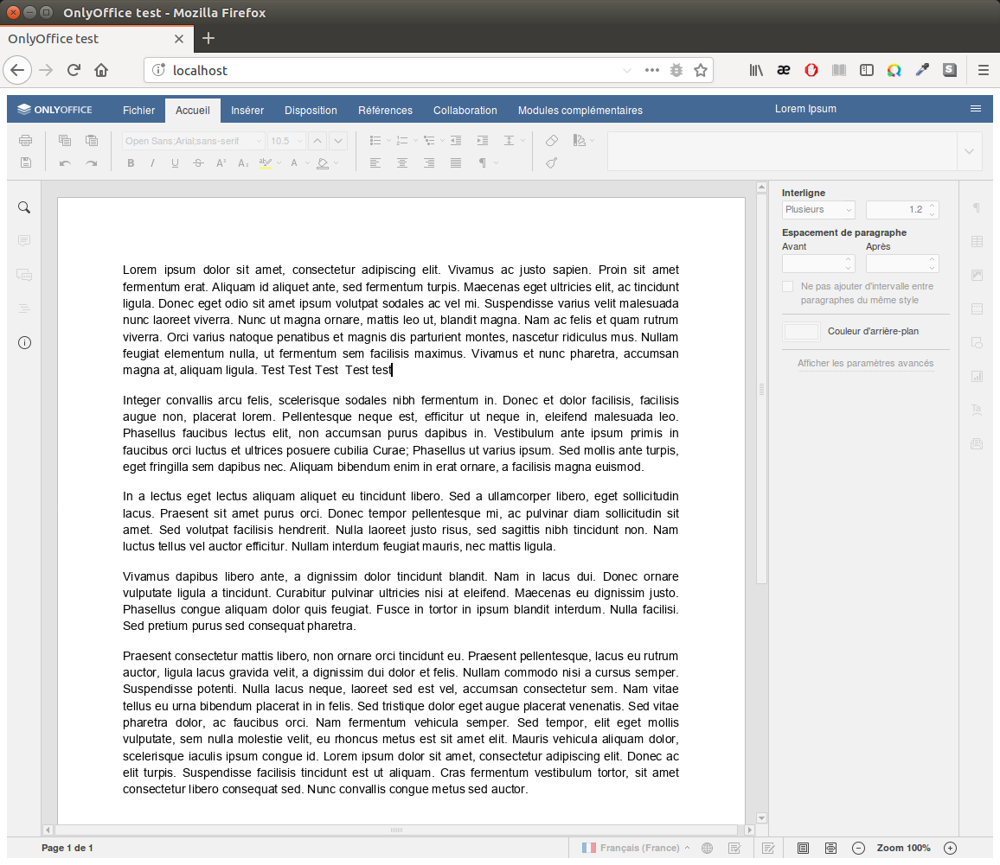

Projet de test de l'éditeur en ligne [OnlyOffice](https://www.onlyoffice.com/fr/)

Ce projet met en place une infrastructure simple avec Docker comportant :
  * onlyoffice-app : une page web présentant l'éditeur OnlyOffice.
  * onlyoffice-documentstorage : une application Node.js qui va sauver les modifications effectuées sur le fichier d'exemple « test.docx »
  * onlyoffice-documentserver : le serveur fourni par OnlyOffice qui enverra au composant onlyoffice-documentstorage les modifications apportées au document d'exemple.

Pour faire fonctionner ce projet il faut :
  1. acquérir une licence auprès d'Ascensio et la copier dans data/license.lic
  2. indiquer dans le fichier onlyoffice-app/index.html l'adresse IP externe qui sera utilisée à partir du conteneur onlyoffice-documentstorage pour télécharger la version modifiée du document auprès du serveur onlyoffice-documentserver. Cette adresse sera aussi utilisée par le script pour télécharger le fichier Javascript nécessaire à OnlyOfffice.
  3. lancer le projet avec la commande suivante :
  
    docker-compose up --build
    
  